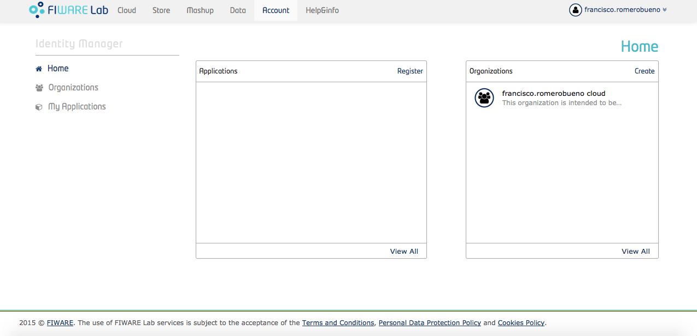
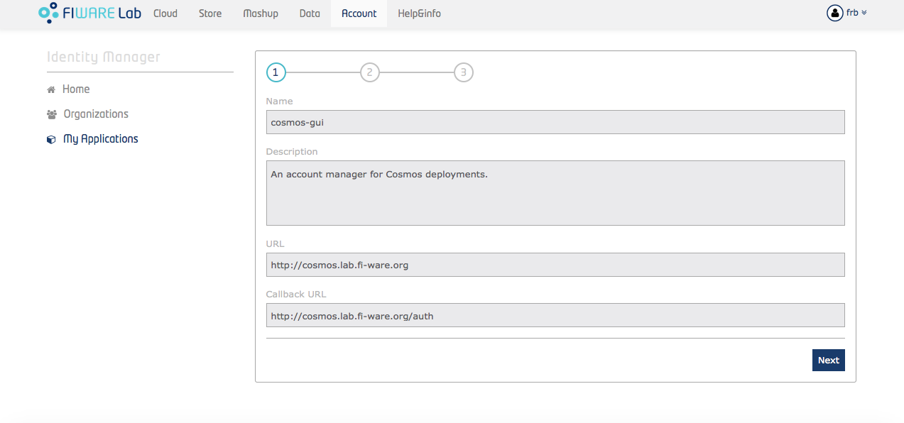
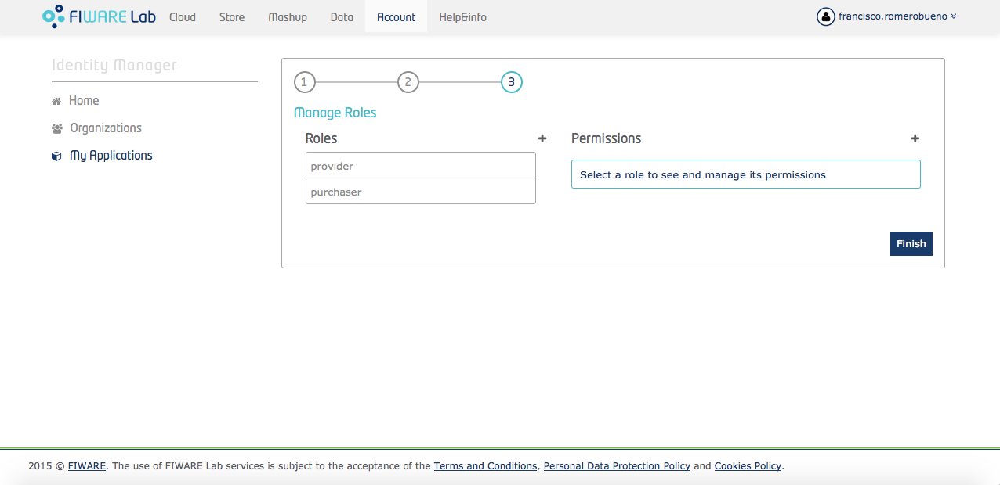
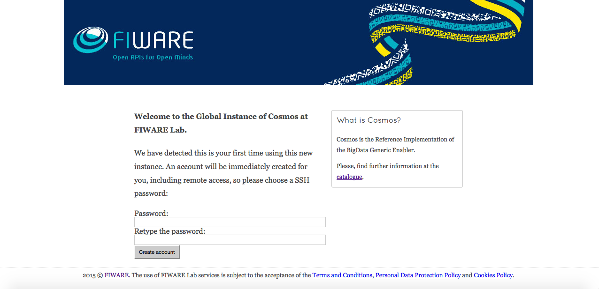
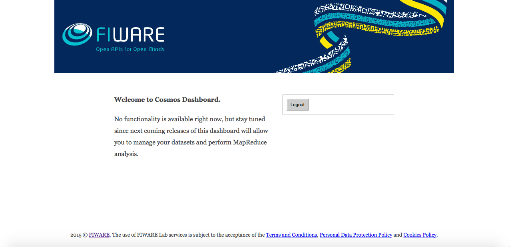

#Cosmos GUI

* [What is cosmos-gui](#whatis)
* [Installation](#maininstall)
    * [Prerequisites](#prerequisites)
    * [Installing the GUI](#gui)
    * [Installing the database](#database)
    * [Unit tests](#unittests)
* [Configuration](#configuration)
* [Running](#running)
* [Usage](#usage)
    * [Login](#login)
    * [Cosmos account provision](#provision)
        * [Migration from an old version of Cosmos](#migration)
    * [Dashboard](#dashboard)
* [Reporting issues and contact information](#contact)

##What is cosmos-gui
This is one of the pieces of the named "Cosmos Ecosystem". Within such an ecosystem there is a [Hadoop](http://hadoop.apache.org/)-based implementation of FIWARE's BigData Analysis Generic Enabler; such a solution is based on the split of storage and computing capabilities:

* A only-[HDFS](https://hadoop.apache.org/docs/current/hadoop-project-dist/hadoop-hdfs/HdfsUserGuide.html) cluster for permanently storing the user data.
* Depending on the available resources and the goals pursued by your deployment, there are two flavours for the computing side:
    * Another Hadoop cluster, shared among all the users, addressing data processing and only allowing for temporal storage.
    * A [Sahara](https://wiki.openstack.org/wiki/Sahara)-based platform for on-demand private temporal Hadoop clusters.

As seen, the storage cluster is always shared, and depending on the chosen flavour, the computing cluster is shared as well. Thus a provisioning procedure is require in order to create specific Unix users and HDFS user spaces within both clusters; this is also know as creating a <i>Cosmos account</i>. This procedure is automated by this cosmos-gui, a Node.js application rendering a set of web pages mainly in charge of guiding the user through this provisioning step.

In addition, the cosmos-gui can be used as a centralized dashboard where a user can explore its HDFS space and run [predefined MapReduce](https://github.com/telefonicaid/fiware-tidoop/tree/develop/tidoop-mr-lib-api) jobs, once his/her Cosmos account has been provisioned.

[Top](#top)

##Installation
This is a software written in JavaScript, specifically suited for [Node.js](https://nodejs.org) (<i>JavaScript on the server side</i>). JavaScript is an interpreted programming language thus it is not necessary to compile it nor build any package; having the source code downloaded somewhere in your machine is enough.

[Top](#top)

###Prerequisites
This GUI has no sense if there is no storage and computing clusters to be managed.

A couple of sudoer users, one within the storage cluster and another one wihtin the computing clusters, are required. Through these users the cosmos-gui will remotely run certain administration commands such as new users creation, HDFS userspaces provision, etc. The access through these sudoer users will be authenticated by means of private keys.

The Cosmos users management is done by means of a [MySQL](https://www.mysql.com/) database, thus install it in the same node the GUI runs, or a remote but accessible machine.

As said, cosmos-gui is a Node.js application, therefore install it from the official [download](https://nodejs.org/download/). An advanced alternative is to install [Node Version Manager](https://github.com/creationix/nvm) (nvm) by creationix/Tim Caswell, whcih will allow you to have several versions of Node.js and switch among them.

Of course, common Unix tools such as `git` and `curl` are needed.

[Top](#top)

###Installating the GUI
cosmos-gui must be installed in a machine having ssh access both to the storage and computing clusters the GUI is going to manage. This ssh access may be limited to the Namenode (or Namenodes, if HA is enabled) of each cluster, and it is necessary since certain administration commands are remotely run through ssh.

Start by creating, if not yet created, a Unix user named `cosmos-gui`; it is needed for installing and running the application. You can only do this as root, or as another sudoer user:

    $ sudo useradd cosmos-gui
    $ sudo passwd cosmos-gui <choose_a_password>
    
While you are a sudoer user, create a folder for saving the cosmos-gui log traces under a path of your choice, typically `/var/log/cosmos/cosmos-gui`, and set `cosmos-gui` as the owner:

    $ sudo mkdir -p /var/log/cosmos/cosmos-gui
    $ sudo chown cosmos-gui:cosmos-gui /var/log/cosmos/cosmos-gui

Now, change to the new fresh `cosmos-gui` user:

    $ su - cosmos-gui
    
Before continuing, remember to add the RSA key fingerprints of the Namenodes accessed by the GUI. This fingerprints are automatically added to `/home/cosmos-gui/.ssh/known_hosts` if you try a ssh access to the Namenodes for the first time. 

    $ ssh somesudoeruser@my.storage.namenode.com
    The authenticity of host 'my.storage.namenode.com (192.168.12.1)' can't be established.
    RSA key fingerprint is 96:c4:0b:8c:09:ce:d4:09:91:a2:b2:9c:40:71:9b:c6.
    Are you sure you want to continue connecting (yes/no)? yes
    Warning: Permanently added 'my.storage.namenode.com,192.168.12.1' (RSA) to the list of known hosts.
    
Please observe `somesudoeruser` is the (ficticious) sudoer user required for the storage cluster, as stated in the [Prerequisites](#prerequisites) section. Do the same for the computing cluster.

Then, clone the Cosmos repository somewhere of your ownership:

    $ git clone https://github.com/telefonicaid/fiware-cosmos.git
    
cosmos-gui code is located at `fiware-cosmos/cosmos-gui`. Change to that directory and execute the installation command:

    $ cd fiware-cosmos/comsos-gui
    $ npm install
    
That must download all the dependencies under a `node_modules` directory.

[Top](#top)

###Installing the database
The user management for the storage cluster is done through a MySQL database, `cosmos_gui`. The commands for creating this database and the `cosmos_user` table can be found at `resources/mysql_db_and_tables.sql`.

Simply log into your MySQL deployment and copy&paste the SQL sentences within the above file.

    $ mysql -u <user> -p
    Enter password: 
    Welcome to the MySQL monitor.  Commands end with ; or \g.
    Your MySQL connection id is 1640
    Server version: 5.1.73 Source distribution

    Copyright (c) 2000, 2013, Oracle and/or its affiliates. All rights
    reserved.

    Oracle is a registered trademark of Oracle Corporation and/or its
    affiliates. Other names may be trademarks of their respective
    owners.

    Type 'help;' or '\h' for help. Type '\c' to clear the current input statement.

    mysql> DROP DATABASE cosmos_gui;
    mysql> CREATE DATABASE cosmos_gui;
    mysql> USE cosmos_gui;
    mysql> CREATE TABLE cosmos_user (idm_username VARCHAR(128) NOT NULL PRIMARY KEY UNIQUE, username TEXT NOT NULL, password TEXT NOT NULL, registration_time TIMESTAMP NOT NULL);

[Top](#top)

###Registering the application in the Identity Manager
Authentication in cosmos-gui is done through a FIWARE's Identity Manager (for instance, FIWARE LAB one is `https://account.lab.fiware.org`). By using this kind of authentication the cosmos-gui is integrated in a fully common experience together with many other enablers of the FIWARE ecosystem, instead of performing a propietary user management.

Please observe the user management for accessing the GUI or any other FIWARE component is not related to the Hadoop user management performed, particularly, by this GUI.

Registration must be done one and only once. As an already registered user in the Identity Manager, login (this user will be the admin user). You should be able to see an applications panel, in addition to an organizations panel, in your home tab:

Click in the <i>register</i> button of the applications panel and give a name, a description, a URL and a callback URL for the new application. For instance:

Then choose an image for the application, this will be shown as an icon for future users:

Finally, manage the roles for this application. If you do not expect to add more roles than the default ones, or you simply do not know about roles, skip this step and finish the user registration:

cosmos-gui is now registered:

An important result of the registration process are the OAuth2 credentials that can be inspected by cliking on the apropriate button. These credentials must be configured in cosmos-gui as shown later.

[Top](#top)

###Unit tests
To be done.

[Top](#top)

##Configuration
cosmos-gui is configured through `conf/cosmos-gui.json`. There you will find a JSON document with six main *sections*:

* **gui**:
    * **port**: specifies the listening port for the application. By default it is 80, but can be changed if such a port is being used in your deployment.
* **clusters**:
    * **storage**
        * **endpoint**: IP address or FQDN of the Namenode/HttpFS server of the storage cluster.
        * **user**: Unix user within the Namenode/HttpFS server having sudo permissions.
        * **private_key**: user's private key used to ssh into the Namenode/HttpFS server.
    * **computing**
        * **endpoint**: IP address or FQDN of the Namenode/HttpFS server of the computing cluster.
        * **user**: Unix user within the Namenode/HttpFS server having sudo permissions.
        * **private_key**: user's private key used to ssh into the Namenode/HttpFS server.
* **hdfs**:
    * **quota**: measured in gigabytes, defines the size of the HDFS space assigned to each Cosmos user.
    * **superuser**: HDFS superuser, typically `hdfs`.
* **oauth2**:
    * **idmURL**: URL where the FIWARE Identity Manager runs. If using the global instance at FIWARE LAB, it is `https://account.lab.fiware.org`.
    * **client_id**: this is given by the Identity Manager once the cosmos-gui has been registered.
    * **client_secre**t: this is given by the Identity Manager once the cosmos-gui has been registered.
    * **callbackURL**: URL used by the Identity Manager to return the control to the GUI once the delegated authentication step has finished. This must be `http://localhost:<listening_port>/auth`.
    * **response_type**: must be `code`.
* **mysql**:
    * **host**: IP or FQDN of the host running the MySQL server.
    * **port**: port the MySQL server is listening for new incoming connections. Typically 3306.
    * **user**: a valid user in the MySQL server with permissions to insert into the `cosmos_user` table.
    * **password**: password for the above user in MySQL.
    * **database**: must be `cosmos_gui`.
* **log**:
    * **file_name**: path of the file where the log traces will be saved in a daily rotation basis. This file must be within the logging folder owned by the the user `cosmos-gui`.
    * **date_pattern**: data pattern to be appended to the log file name when the log file is rotated.

[Top](#top)

##Running
The GUI implemented by cosmos-gui is run as (assuming your current directory is `fiware-cosmos/cosmos-gui`):

    $ npm start
    
This command invokes the start script within `package.josn`:

    "scripts": {
        "start": "sudo node ./src/app.js"
    }

Please observe the usage of `sudo`. This is because the GUI must be able to execute certain priviledged Unix and Hadoop commands when setting up Cosmos accounts. **Never run cosmos-gui (nor any other service) as the `root` user.**

If everything goes well, you should be able to see in a web browser the login page (`http://<node_hosting_cosmos_gui>:<port>`):

    
cosmos-gui typically listens in the TCP/80 port, but you can change it by editing `conf/cosmos-gui.conf`.

[Top](#top)

##Usage
###Login
Once installed and run, you can visit `http://<node_hosting_cosmos_gui>:<port>` (adapt the port if you changed it). This page basically prompts the user to login.

The login procedure delegates in FIWARE Identity Manager. This means cosmos-gui does not perform <i>any propietary user management</i> from the GUI point of view (as it will be seen, cosmos-gui performs a propietary user management for accessing the Hadoop cluster; that is, particularly, its purpose). Thus, once clicked the login button, we are redirected to `https://account.lab.fiware.org`:

[Top](#top)

###Cosmos account provision
After authentication (using your email and password registered at the Identity Manager), there are three possibilities:

* You are an already registered user in Cosmos. In this case, you are directly redirected to the dashboard of the GUI.
* You are not a user in Cosmos. In this case, the GUI will provision (one and only once) an account in the managed Hadoop cluster; this comprises:
    * The creation of a Unix user based on your Identity Manager registered email address. This user, together with the password the page asks for, will allow you to ssh into the cluster.
    * The creation of a HDFS user equals to the unix one. This user will allow you to manage your own private HDFS userspace (with limited quota).

    
* You are a user in an old Cosmos deployment. Please, see the next section for further details if your deployment will involve a migration from an old version of Cosmos to the new one. If not, you can skip it.

[Top](#top)

####Migration from an old version of Cosmos
Old Cosmos deployments did not stored in a database the Identity Manager email nor the ssh password, but only the Unix/HDFS username. This is a problem from the migration point of view. This special page of the GUI will provision (one and only once) such an email and password, maintaining the Unix user, the HDFS userspace and the data stored in the old cluster (which must be migrated to the new cluster).

[Top](#top)

###Dashboard
Current version of cosmos-gui has no functionlality exposed in the dashboard, thus cosmos-gui can be seen as a Cosmos account provisioning tool.

Next coming versions of the GUI will allow the users to explore their HDFS space and run predefinied MapReduce jobs from this dashboard. Stay tuned!

[Top](#top)

##Reporting issues and contact information
There are several channels suited for reporting issues and asking for doubts in general. Each one depends on the nature of the question:

* Use [stackoverflow.com](http://stackoverflow.com) for specific questions about the software. Typically, these will be related to installation problems, errors and bugs. Development questions when forking the code are welcome as well. Use the `fiware-cosmos` tag.
* Use [fiware-tech-help@lists.fi-ware.org](mailto:fiware-tech-help@lists.fi-ware.org) for general questions about the software. Typically, these will be related to the conceptual usage of the component, e.g. wether it suites for your project or not. It is worth to mention the issues reported to [fiware-tech-help@lists.fi-ware.org](mailto:fiware-tech-help@lists.fi-ware.org) are tracked under [http://jira.fiware.org](http://jira.fiware.org); use this Jira to see the status of the issue, who has been assigneed to, the exchanged emails, etc, nevertheless the answers will be sent to you via email too.
* Personal email:
    * [francisco.romerobueno@telefonica.com](mailto:francisco.romerobueno@telefonica.com) **[Main contributor]**
    * [german.torodelvalle@telefonica.com](german.torodelvalle@telefonica.com) **[Contributor]**

**NOTE**: Please try to avoid personaly emailing the contributors unless they ask for it. In fact, if you send a private email you will probably receive an automatic response enforcing you to use [stackoverflow.com](stackoverflow.com) or [fiware-tech-help@lists.fi-ware.org](mailto:fiware-tech-help@lists.fi-ware.org). This is because using the mentioned methods will create a public database of knowledge that can be useful for future users; private email is just private and cannot be shared.

[Top](#top)
