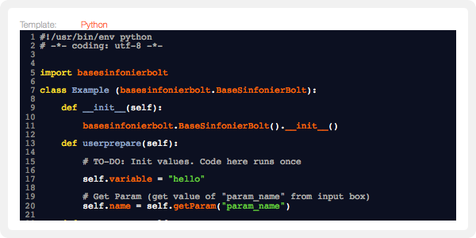
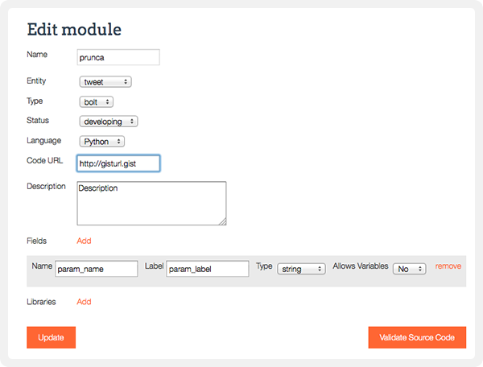
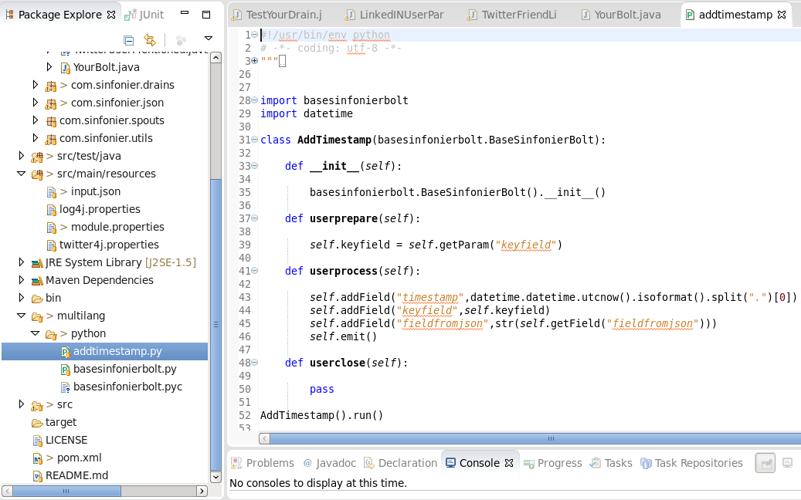
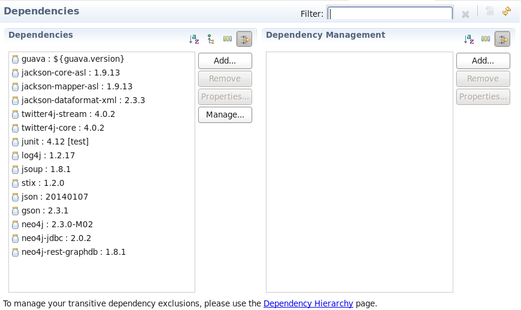
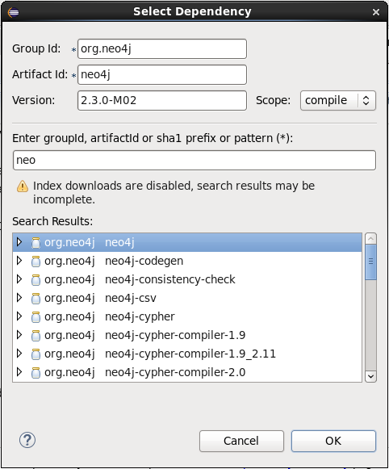
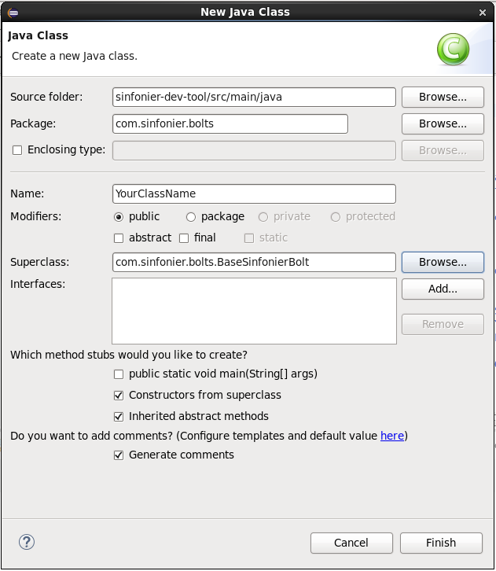
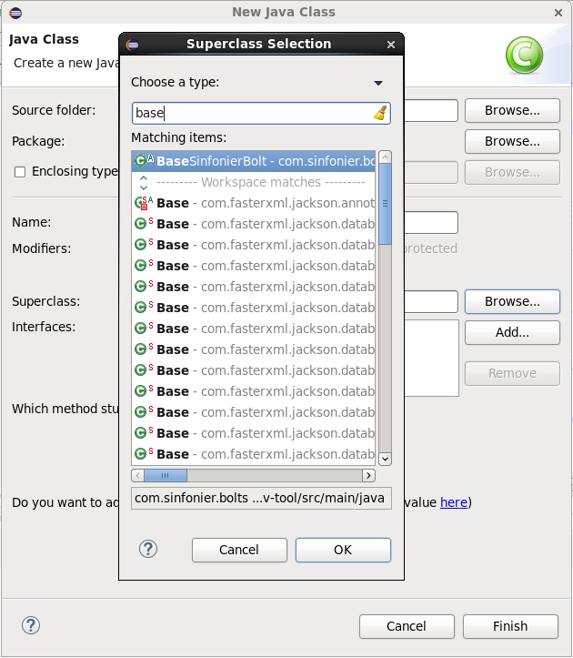
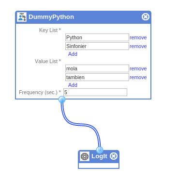
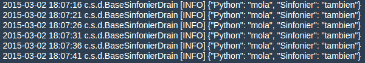

#Stream processing: Sinfonier Modules

Content: 

* [Module](#section1)
* [Creating a Module](#section2)
* [Development environment](#section3)
* [Creating a Java Module](#section4)
* [Creating a Python Module](#section5)

[Top](#top)

##Module

Modules are pieces of code created by users and used by themselves in their topologies. First of all, modules must be validated by an administrator to ensure that your module is fit for publication, after that, you can make your contribution to the community and publish it.

Sinfonier supports three types of modules. Spouts and Bolts from Storm model, and includes Drains on topologies. Drains are just bolts responsible for handling information once processed in the topology.

Before you start to create modules on Sinfonier check you fulfill these requirements:

* Have a Github [http://github.com] account and know how to create a Gist.

* Have greats ideas and know how to implement them.

* Check the conditions of use.

[Top](#top)

##First Module

Creating a module consists of a simple two step process: Declare it and Ask for review. First you may declare your module. The process is as simple as:

* **Adding a name**
	* Be smart at this point, name is the first thing other users see
	* Use Java names convention
* **Select an entity**
	* Sinfonier uses it to classify your module
* **Select module type**
	* Spout, Bolt or Drain
	* Module type won't be changed
* **Choose language to be used**
	* Currently Sinfonier is able to work with Java and Python
	* If you are Python developer don't worry, although Apache Storm need some Java code when you are using Python Sinfonier create this code for you.
* Now it’s time to **refer your code**
	* Using a Gist
* Write a good **description**
	* Description helps other users to know your module features
* **Add fields** if needed
	* Fields are your inputs. Typical example is an API-Key param.
	* See "Playing with Field" above to know more about that.
* Last but not least tell Sinfonier if you need additional **libraries**
	* You can check current libraries in Package section.

Every module is created in “developing” state. So… It’s time to code!

Your module has everything needed but one thing: The code. Sinfonier helps you offering a template based on module type, module name and module language. You only need to worry about the module functionality.

Use this template to create your Gist and then put the Gist URL into “Code URL” gap. Once you have your code ready you can request for validation and after that use it on your topologies. After your module has been validated you can choose to share it with other users publishing it, just changing it to the "public" state.

**Understanding module states (GC)**

Maybe this could be the most complicated concept in Sinfonier.

**Playing with fields**

Fields are parameters that users have to fill for using modules. Developers must get this data using "getParam" method (Java lang.). Typical use could be get an API-Key to be used on a “bolt” to get data from an authenticated external service, or just a simple filter need on a "Spout".

TIP: Use a human-readable text on "Label" and developing style text on "Name".

**Updating a module**

Did you improve your module? Just update your Gist code and notify us using "Update source code" button on edit module page.

**Delete a module**

It is possible to delete a module for the owner of a module by clicking the "Delete" button in the detail of the module.Be aware that if you delete it, it will not be available at your “My tools” list anymore, however, it will remain functional enough in your already implemented topologies.

----
Do you want to see it in action?

*Creating a python bolt from the scratch. This bolt sends an email address to http://hesidohackeado.com via API and returns the response.*

----

----

[Top](#top)

###States of the module

* **Developing:**
	* This is the first state of the modules just after its creation. At this point, the module can only be seen by the owner. It is possible to change the code until the validation request is sent. After sending this request, pending is the next state of the module.
* **Pending:**
	* This is the after state to the creation and developing of a module. At this point, the module has to be validated by an administrator. The administrator has two possibilities, if the module is correct and the administrator considers it proper, it will be validated and the next state of the module will be private. If not, the module will be sent back again to the developing status.
* **Private:**
	* When a module is at this state, it can only be seen by the owner of the module and can be used to implement new topologies by the user. If the user wants, the module can be published passing it to the published status.
* **Published:**
	* This state is very similar to the private state, with the difference that at this point everybody can use this   module to implement his new topologies. The owner of the module can switch between the private and published state whenever he wants. If the owner of the module changes the code of it at published or private state, it will need validation, so it will go again to the pending status.
* **Deleted:**
	* This is a point of non return, when a module is deleted it is not going to be available anymore, however, it could be used by the topologies already implemented. Only the owner of a module can delete it.

Frequently asked question

* **I deleted a module but It’s been on my topology**
	* After a module has been deleted users (included module owner) can’t use it for implementing new topologies, however already implemented topologies can still make use it.

[Top](#top)

##Development environment

In order to make easier develop and test modules Sinfonier Team, using code developed by Gaspar Muñoz, is creating a virtual machine that includes all you need to create new modules and create unit test before you upload your modules to Sinfonier.

* Just download .ova file.
	* [Sinfonier Dev. Environment Virtual Machine](https://goo.gl/owpyr4)
* Import in your VirtualBox Software.
* Run virtual machine
* Use “sinfonier” to login password
* Start creating modules using Eclipse

Eclipse include sinfonier-dev-tool as a project created from Github repository.

[Tool to build modules for Sinfonier project.](https://github.com/sinfonier-project/sinfonier-dev-tool)

Eclipse include all plugins needed to edit python files, use maven repositories and work with Github.

If your module, Spout, Bolt or Drain needs an external library you can add it using Maven dependencies manager included in Eclipse.

Eclipse show you your current dependencies:

And allow you to add new one using a simple form:

However you can search dependencies in [Maven Repository](http://mvnrepository.com/) and add them directly into pom.xml file.

##Creating a Java Module

Once you have your virtual machine up and running and Eclipse is started. Select the package where you want to add new modules and create a *new java class*.

Your superclass should be one of BaseSinfonierBolt, BaseSinfonierSpout or BaseSinfonierDrain from com.sinfonier.* package.

Using browser option type first words from class names and select superclass.

As a result Eclipse creates a new class with al methods to be rewritten and Sinfonier MIT license. Ready to start working with...

	/**
	*   The MIT License (MIT)
	*
	*   Copyright (c) 2015 sinfonier-project
	*
	*   Permission is hereby granted, free of charge, to any person obtaining a copy
	*   of this software and associated documentation files (the "Software"), to deal
	*   in the Software without restriction, including without limitation the rights
	*   to use, copy, modify, merge, publish, distribute, sublicense, and/or sell
	*   copies of the Software, and to permit persons to whom the Software is
	*   furnished to do so, subject to the following conditions:
	*
	*   The above copyright notice and this permission notice shall be included in
	*   all copies or substantial portions of the Software.
	*
	*   THE SOFTWARE IS PROVIDED "AS IS", WITHOUT WARRANTY OF ANY KIND, EXPRESS OR
	*   IMPLIED, INCLUDING BUT NOT LIMITED TO THE WARRANTIES OF MERCHANTABILITY,
	*   FITNESS FOR A PARTICULAR PURPOSE AND NONINFRINGEMENT. IN NO EVENT SHALL THE
	*   AUTHORS OR COPYRIGHT HOLDERS BE LIABLE FOR ANY CLAIM, DAMAGES OR OTHER
	*   LIABILITY, WHETHER IN AN ACTION OF CONTRACT, TORT OR OTHERWISE, ARISING FROM,
	*   OUT OF OR IN CONNECTION WITH THE SOFTWARE OR THE USE OR OTHER DEALINGS IN
	*   THE SOFTWARE.
	*/
	package com.sinfonier.bolts;

	/**
	 * @author sinfonier
	 *
	 */
	public class YourClassName extends BaseSinfonierBolt {

		/**
		 * @param path
		 */
		public YourClassName(String path) {
			super(path);
			// TODO Auto-generated constructor stub
		}

		@Override
		public void userprepare() {
			// TODO Auto-generated method stub

		}

		@Override
		public void userexecute() {
			// TODO Auto-generated method stub

		}

		@Override
		public void usercleanup() {
			// TODO Auto-generated method stub

		}

	}

Once your module (bolts in our examples) is ready to be tested it’s time to write your unit test and ensure our code works as expected.

	import com.sinfonier.utils.ComponentType;
	import com.sinfonier.utils.Runner;
	import org.junit.Assert;
	import org.junit.Before;
	import org.junit.Test;

	import java.util.Map;

	public class TestYourBolt {

	    @Before
	    public void setUp() {
	    }

	    @Test
	    public void testYourBolt() {
	        // Instantiate your module
	        Map<String, Object> result = Runner.run(ComponentType.BOLT, YourClassName.class,0);

	        // Code the test conditions
	        Assert.assertNotNull(result.get("result"));
	        Assert.assertEquals(4, Integer.parseInt(result.get("result").toString()));
	    }
	}

##Creating a Python Module

##Python Spouts with Scheduler

 As in the case of Java, we can code Spouts in Python with execution determined by a time interval. This allows us to query an API or a RSS feed from time to time, without doing continuous requests every 100ms.

Coding these Spouts in Python is much easier than Java ones. We just have to use the Python library apscheduler. Using this library, we'll launch a scheduler and this scheduler will be responsible for running a function according a frequency parameter.

Below we see a sample Spout. It's a Dummy Spout, like the Java one, but in this case coded in Python. It's a public module in Sinfonier Community:

http://drawer.sinfonier-project.net/modules/DummyPython

	#!/usr/bin/env python
	# -*- coding: utf-8 -*-
	"""
	    The MIT License (MIT)

	    Copyright (c) 2014 sinfonier-project

	    Permission is hereby granted, free of charge, to any person obtaining a copy
	    of this software and associated documentation files (the "Software"), to deal
	    in the Software without restriction, including without limitation the rights
	    to use, copy, modify, merge, publish, distribute, sublicense, and/or sell
	    copies of the Software, and to permit persons to whom the Software is
	    furnished to do so, subject to the following conditions:

	    The above copyright notice and this permission notice shall be included in
	    all copies or substantial portions of the Software.

	    THE SOFTWARE IS PROVIDED "AS IS", WITHOUT WARRANTY OF ANY KIND, EXPRESS OR
	    IMPLIED, INCLUDING BUT NOT LIMITED TO THE WARRANTIES OF MERCHANTABILITY,
	    FITNESS FOR A PARTICULAR PURPOSE AND NONINFRINGEMENT. IN NO EVENT SHALL THE
	    AUTHORS OR COPYRIGHT HOLDERS BE LIABLE FOR ANY CLAIM, DAMAGES OR OTHER
	    LIABILITY, WHETHER IN AN ACTION OF CONTRACT, TORT OR OTHERWISE, ARISING FROM,
	    OUT OF OR IN CONNECTION WITH THE SOFTWARE OR THE USE OR OTHER DEALINGS IN
	    THE SOFTWARE.
	"""

	import basesinfonierspout
	import json
	from apscheduler.schedulers.background import BackgroundScheduler
	from collections import deque
	import time

	class DummyPython(basesinfonierspout.BaseSinfonierSpout):

	    def __init__(self):

	        basesinfonierspout.BaseSinfonierSpout().__init__()

	    def useropen(self):

	        # Using deque as a queue
	        self.queue = deque()

	        self.keylist = self.getParam("keylist")
	        self.valuelist = self.getParam("valuelist")
	        self.interval = int(self.getParam("frequency"))        

	        # This scheduler launches self.job function every X seconds
	        self.sched = BackgroundScheduler()
	        self.sched.add_job(self.job, "interval", seconds=self.interval, id="dummyspout")
	        self.sched.start()

	    def usernextTuple(self):

	        # If there are items in self.queue, get the first one (.popleft()), do what you want with it and emit the tuple
	        if self.queue:
	            self.d = self.queue.popleft()
	            self.emit()
	        else:
	            time.sleep(0.5)

	    def job(self):

	        try:
	          keysandvalues = dict(zip(self.keylist, self.valuelist))
	          for key,value in keysandvalues.items():
	              item = {key:value}
	              self.queue.append(item)
	        except:
	            self.queue.append({"dummypythonerror","Must have the same number of keys and values"})

	DummyPython().run()

ts operation is very simple. In the function "useropen" we have to initialize variables. We get the 'keylist' and 'valuelist' parameters (both type list) and start the scheduler.

The scheduler is configured to launch the function self.job every time is reached the interval time introduced by the parameter frequency. In that function, we'll type our code, but instead emit the tuple here, we are going to append our dict to a queue. This queue is constantly checked in usernextTuple, and when it has new items, they are emitted.

In this Spout, we use a very useful function to merge in a dictionary the keys and values we have introduced by parameter in both lists. Without using any for loop.

	keysandvalues = dict(zip(self.keylist, self.valuelist))

To test this, we have made a small topology with a DummyPython Spout and a LogIt Drain. In the Spout is set the keys and values are going to be emitted and the execution frequency.

Checking the log we can see the expected result. Easy and simple :)

