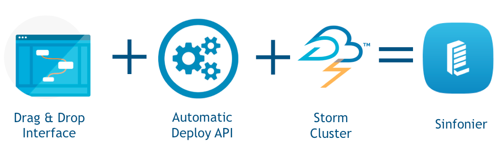

#Stream processing: Apche Storm & Sinfonier 

Content: 

* [Concepts](#section1)
* [Sinfonier](#section2)

##Concepts

There are three different types of computer processing: Batch Processing, Online Processing and Real-time Processing.

Batch processing is an efficient way of processing high volumes of data is where a group of transactions is collected over a period of time. Data is collected, entered, processed and then the batch results are produced (Hadoop is a main example). Typically used on billing process or non real time task.

Online processing processes information when it is received and performs data processing instantly. This type of processing is set to processes where there is an iteration by external systems for example online commerce transactions.

Real-time processing involves a continual input, process and output of data. Data must be processed in a small time period (or near real time).

[Top](#top)

###Real-Time Processing

Since there are many solutions and platforms that provide support for many of the requirements for batch processing over information stored or “at-rest”, Sinfonier focuses its efforts on maximizing data processing in real-time, offering capabilities that simplify and maximize the use of real-time technologies.

MapReduce, Hadoop, and related technologies have made it possible to store and process data at scales previously unthinkable. Unfortunately, these data processing technologies are not real time systems. There's no way that will turn Hadoop into a real time system.

In a nutshell these are the main differences between Hadoop and Storm:

| Hadoop        | Storm         |
|:-------------:|:-------------:|
| Large but finite jobs | Infinite computations called Topologies |
| Processes a lot of data at once | Process Infinite streams of data one tuple at a time |
| High Latency | Low Latency     |

However, real time data processing at massive scale is becoming more and more of a requirement for businesses and definitely for Security industry.

Nowadays data generating is increasing. Real time processing is needed to get this information and determine if an action is required. In a security point of view, these data contains potential information which may involve a potential risk, so it is necessary to be able to detect it early.

New framework implements new paradigms are needed. Key properties of this type of solutions should be:

* **Extremely broad set of use cases**: It should be used for processing messages and updating databases (stream processing), doing a continuous query on data streams and streaming the results into clients (continuous computation), parallelizing an intense query like a search query on the fly (distributed RPC), and more.

* **Scalable**: It should be scale to massive numbers of messages per second.

* **Guarantees no data loss**: A realtime system must have strong guarantees about data being successfully processed. A system that drops data has a very limited set of use cases.
 
* **Extremely robust**: It should be simple manage.

* **Fault-tolerant**: If there are faults during execution of your computation, system will reassign tasks as necessary. System should make sure that a computation must run forever (or until you kill the computation).

* **Programming language agnostic**: Robust and scalable realtime processing shouldn't be limited to a single platform. 

[Top](#top)

###Storm

Apache Storm is a free and open source distributed real time computation system. Storm is simple, can be used with any programming language. It is scalable, fault-tolerant, guarantees your data will be processed, and is easy to set up and operate. --from official web page--

Originated at Backtype, acquired by Twitter in 2011. Storm become Open Source late 2011 and was part of Apache Incubator late 2013. Today Storm is top level Apache project.

Storm is a platform for perform analysis on streams of data (continuous data flows) as they receive or collect, enabling information processing as it happens.

Storm has many use cases: real time analytics, online machine learning, continuous computation, distributed RPC, ETL, and more. Storm is able to integrates with the queueing and database technologies you already use is your systems.

----

[Top](#top)

####Storm main concepts

Storms use Stream concept, seen a stream as an unbounded sequence of tuples. Every stream has an “id”. Stream is defined with a schema that names the fields in the tuple. Tuples values must be serializable.

Storm implements Topologies. A Topology is a graph where each node is a spout or a bolt. Edges indicating which bolt subscribes to which stream.

Storm users define topologies for how to process the data when it comes streaming in from the spout. When the data comes in, it is processed and the results are passed to output systems.

Storm cluster has three sets of nodes:

* **Nimbus node**: It is the master node and responsible of distributes code across the cluster, launch workers and monitor computation and reallocates workers as needed.

* **Zookeeper nodes**: Coordinates the Storm cluster.

* **Supervisor nodes**: Starts and stops workers according to signals from Nimbus (communicates with Nimbus through Zookeeper)

[Top](#top)

##Sinfonier

Sinfonier represents a change in focus in respect to current solutions in the area of real-time
information processing. We combine an easy-to-use interface, which is modular and adaptable, and we integrate it with an advanced technological solution that allows customers to do the necessary tune up required for their needs in matters concerning information security.

Sinfonier is borne out of the cooperation and knowledge, where any work can be re-used and the efforts are invested in improving the processing and collection of the new information which is generated.

Putting at the customer’s disposal, the ability to collect information from multiple sources,
process and enrich it in a continuous and dynamic way. It will be up to the users, to provide the
algorithms with content in the form of topologies and get the most out of this information.

Sinfonier implements a new abstraction level in Storm, simplifying, even more, the creation of abstractions (modules in Sinfonier) and topologies.

----

Apache Storm is a free, open source, distributed, real-time computation system. Storm is based on three main abstractions: "Spouts", "Bolts" and "Topologies". But Sinfonier includes one more
abstraction: "Drains". Thus, a topology is not only a network of spouts and bolts, but also of drains. At the top of the topologies Spouts are placed: they are a source of streams, in other words, they are the feeders of the topologies. After that, Bolts process input streams and produce new output streams.

Finally, Drains send input streams to both storage and other services. By means of these drains,
analysts can connect specific modules allowing them to create and implement their own intelligence methodology in an easy-to-use and intuitive manner without requiring programming knowledge. Once complete, these new abstractions can be shared privately or publicly, culminating in a crowd-sourced intelligence system.

[Top](#top)

###Sinfonier components

Three main components of Sinfonier are:

* **Sinfonier Editor** which allows users to create new topologies using a Drag & Drop methodology on a canvas: Here is where you can implement or edit your topologies. 
    * The editor makes use of a drag & plug interface, it is very intuitive and easy to get used to. The operation is very simple, drag the modules from the left placed list to the central canvas and plug them however you want by clicking on the connectors provided by every module. 
    * If you want to delete a module, just click the cross of the module. Finally, remember to name your topology, there is a field for this purpose at the right side of the screen.

* **Backend with an API to automatically manage a Storm cluster**.
    * Launch toplogies 
    * Stop topologies
    * Rebalance topologies
    * Add new modules (Spouts, Bolts and Drains)
        * Sinfonier includes one more abstraction: "Drains". Thus, a topology is not only a network of spouts and bolts, but also of drains. Drains send input streams to both storage and other services.
    * Manage cluster Java and Python dependencies 

* **Apache Cluster**
    * Sinfonier use a standard Apache Storm cluster. Last version support Storm version 0.9.6 and development team is working to validate 0.10.0 release.

[Top](#top)

###Sinfonier versus Storm

Below we show key differences between Apache Storm and Sinfonier Project.

|               | Apache Storm  | Sinfonier Project |
|:-------------:|:-------------:|:-------------:|
| Topologies    | Programmatically DAG | Visual DAG |
| Components | Spouts and Bolts | Spouts, Bolts and Drains |
| Grouping | Shuffle, Field, All (+4) | Shuffle |
| Data Model | Tuples<K,V> | JSON Tuple K,V |

[Top](#top)

###Data model

One of the requirements to implement a collaborative system like Sinfonier is to ensure all modules are able to communicate. For this reason Sinfonier defines a data model based on a single JSON tuple instead of Apache Storm data model based on an indeterminate number of tuples <K,V>.

This approach allow users to share and use others user’s modules into the platform and Sinfonier includes an API to manage this JSON tuple in a simple way. Allowing users to add new fields, remove fields and check fields exists. API current support Java and Python language.

[Top](#top)

###Modules

|               | Spouts        | Bolts         | Drains        |
|:-------------:|:-------------:|:-------------:|:-------------:|
| Interface to be implemented    | BaseSinfonierSpout | BaseSinfonierBolt | BaseSinfonierDrain |
| Target | Gathering data| Transforms data| Store data |
| Emit | Yes| Yes | No |
| Methods | useropen() usernexttuple() userclose() | userprepare() userexecute() usercleanup()| userprepare() userexecute() usercleanup()|

**Spout**

“A spout is a source of streams in a computation. Typically a spout reads from a queueing broker such as Kestrel, RabbitMQ, or Kafka, but a spout can also generate its own stream or read from somewhere like the Twitter streaming API. Spout implementations already exist for most queueing systems.”

**Bolt**

“A bolt processes any number of input streams and produces any number of new output streams. Most of the logic of a computation goes into bolts, such as functions, filters, streaming joins, streaming aggregations, talking to databases, and so on.”

**Drain**

“A drain processes any number of input streams and sent it to external services. Databases, Dashboards, or just log information into a file.”

[Top](#top)