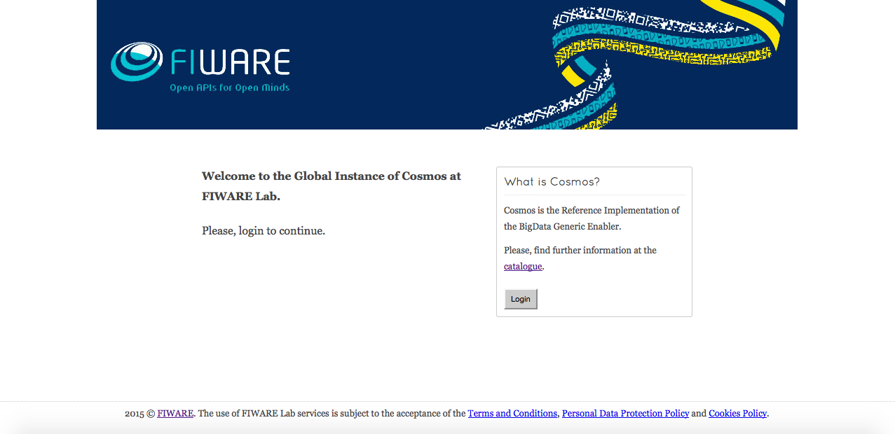
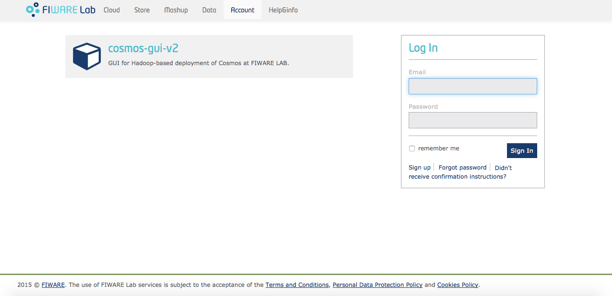
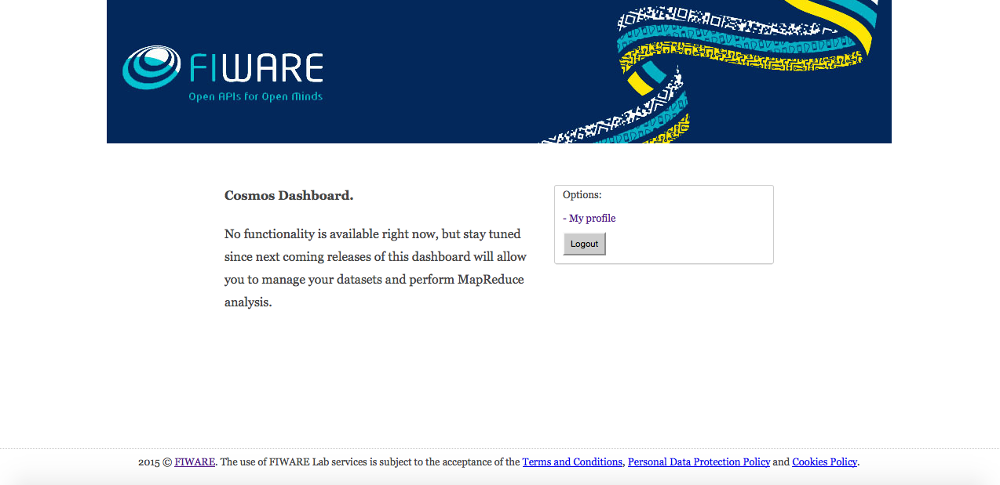

# Using Cosmos GUI
Content:

* [Login](#section1)
* [Cosmos account provision](#section2)
* [Dashboard](#section3)
* [Profile](#section4)

## Login
Once installed and run, you can visit `http://<node_hosting_cosmos_gui>:<port>` (adapt the port if you changed it). This page basically prompts the user to login.

The login procedure delegates in FIWARE Identity Manager. This means cosmos-gui does not perform <i>any propietary user management</i> from the GUI point of view (as it will be seen, cosmos-gui performs a propietary user management for accessing the Hadoop cluster; that is, particularly, its purpose). Thus, once clicked the login button, we are redirected to `https://account.lab.fiware.org`:

[Top](#top)

## Cosmos account provision
After authentication (using your email and password registered at the Identity Manager), there are two possibilities:

* You are an already registered user in Cosmos. In this case, you are directly redirected to the dashboard of the GUI.
* You are not a user in Cosmos. In this case, the GUI will provision (one and only once) an account in the managed Hadoop clusters (both storage and computing); this comprises:
    * The creation of a Unix user based on your Identity Manager registered ID.
    * The creation of a HDFS user equals to the Unix one. This user will allow you to manage your own persistent private HDFS userspace within the storage cluster (with limited quota), and the temporal private HDFS userspace within the computing cluster (with limited quota).

Please observe when the storage and computing clusters are the same (it is not the recommended architecture, but it is feasible from a technical point of view) only one provisioning step is done, as it is obvious.

[Top](#top)

## Dashboard
Current version of cosmos-gui has no functionality exposed in the dashboard, thus cosmos-gui can be seen as a Cosmos account provisioning tool.

Next coming versions of the GUI will allow the users to explore their HDFS space and run predefined MapReduce jobs from this dashboard. Stay tuned!

The only option for the time being is to access to the profile page (see next section).

[Top](#top)

## Profile
The profile section shows the user account details and certain statistics, such as the HDFS quota usage.

This is useful in order to know the credentials the user has in the Cosmos platform.

[Top](#top)
